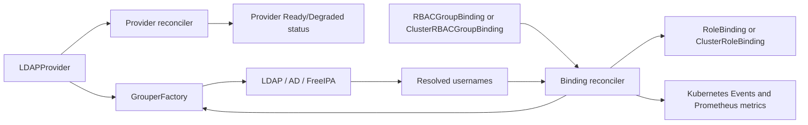

# Architecture

The manager watches three CRDs. `LDAPProvider` owns connection settings and
its own bind-only status check. `RBACGroupBinding` and
`ClusterRBACGroupBinding` use a provider to resolve a group and reconcile one
Kubernetes RBAC object each.



The binding reconcilers are fail-safe: when a directory is unavailable or a
group cannot be resolved, they mark the CR degraded but leave the last known
RBAC subjects in place. Owner references remove a managed binding when its CR
is deleted.

`/healthz` reports process health. `/readyz` reads cached `LDAPProvider`
conditions rather than dialing LDAP, so a slow remote directory cannot stall a
Kubernetes readiness probe.

## Duplicate-mapping validation

An optional validating webhook (`internal/webhook`, `webhook.enabled` Helm
value) rejects a `RBACGroupBinding`/`ClusterRBACGroupBinding` create or
update that would leave two bindings of the same kind mapping the same
`groupDN` to the same role in the same scope (namespace for
`RBACGroupBinding`, cluster-wide for `ClusterRBACGroupBinding`). Two bindings
doing that would each independently reconcile their own, differently-named
managed object with identical subjects and permissions - never useful, and
far more likely a copy-paste mistake than intent.

This is a webhook rather than a `+kubebuilder:validation:XValidation` CEL
rule (the way `LDAPProviderSpec.DirectoryType`'s enum is validated) because
CEL rules only see the single object being validated. Catching a duplicate
requires listing sibling objects, which only an admission webhook can do.

It's off by default because it needs cert-manager to provision the webhook
server's TLS certificate; a plain install shouldn't have to take on that
dependency just to get the reconcilers working. Enable it with
`--set webhook.enabled=true` once cert-manager is installed.

## Extending to a new directory backend

`internal/ldapclient.Grouper` is the entire surface a reconciler depends on:

```go
type Grouper interface {
    GetGroupMembers(ctx context.Context, groupDN string) ([]string, error)
}
```

`ldapclient.Client` is the only implementation today, and `DirectoryType`
(`OpenLDAP`/`ActiveDirectory`/`FreeIPA`, see Directory-Backends) only ever
switches behavior *inside* that one implementation - paging, referral
handling, and the AD nested-group matching rule are all still one LDAP
client speaking to something that is, at the wire level, an LDAP server.

A genuinely different membership source - SCIM, Google Workspace, Okta -
doesn't fit inside `DirectoryType`: it isn't a variation in LDAP query
behavior, it's a different protocol entirely. That's what the `Grouper`
interface itself is for. Adding one means:

1. A new package alongside `internal/ldapclient` (e.g. `internal/scimclient`)
   implementing `Grouper` against that source's actual API.
2. A `GrouperResolver` (mirroring `controller.GrouperFactory`) that builds
   one from whatever an `LDAPProvider`-equivalent CRD (or a new CRD, if the
   connection settings don't fit `LDAPProviderSpec`) describes.
3. Nothing in `RBACGroupBindingReconciler` or `ClusterRBACGroupBindingReconciler`
   changes: both already depend on the `Grouper`/`GrouperResolver` interfaces,
   not on `ldapclient.Client` directly, specifically so this extension point
   wouldn't require touching the reconcile loop.

No second backend is implemented today - LDAP/AD is the only one with a
concrete, supportable membership contract this project currently maintains -
but the reconcilers were designed against the interface from the start
rather than the concrete client, so adding one is additive, not a refactor.
