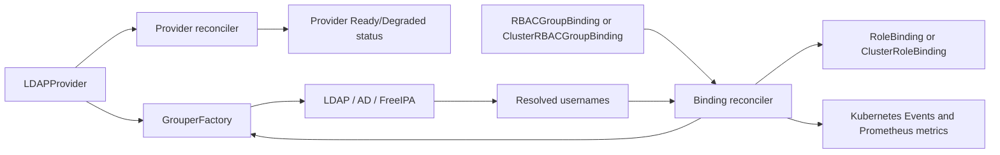

# Architecture

The manager watches three CRDs. `LDAPProvider` owns connection settings and
its own bind-only status check. `RBACGroupBinding` and
`ClusterRBACGroupBinding` use a provider to resolve a group and reconcile one
Kubernetes RBAC object each.

The binding reconcilers are fail-safe: when a directory is unavailable or a
group cannot be resolved, they mark the CR degraded but leave the last known
RBAC subjects in place. Owner references remove a managed binding when its CR
is deleted.

`/healthz` reports process health. `/readyz` reads cached `LDAPProvider`
conditions rather than dialing LDAP, so a slow remote directory cannot stall a
Kubernetes readiness probe.
